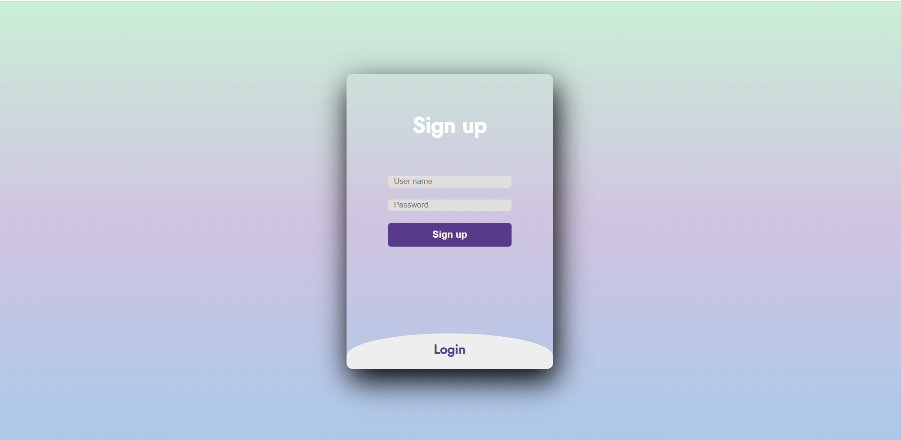
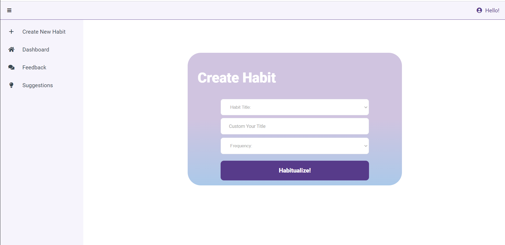
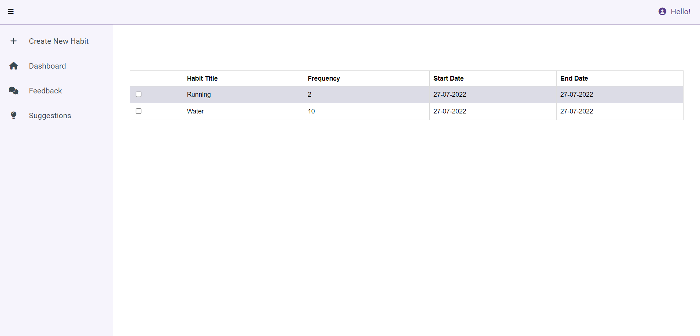

# Habitual 
### Table of Contents
- About
- Features and Technologies
- Screenshots
- Challenges
- Installation & Usage

## About
Habitual keeps you on track so that you can focus your energy on the things that really matter.In this app guest can choose habit or create customise there own habit. Guest can track there activity daily or weekly. Guest can delete the activitys which is already done. 

## Features
- login as a guest
- Choose a habit you want to track (e.g water, exercise, 8 hours of sleep) and choose the frequency at which you want to track the habit.
- You can track a habit and mark it as complete for the day 
- You can also see your most recent completion streak and remove completed activity as well.

## Technologies
- Figma
- Trello
- VS Code
- MongoDB
- express
- Jest
- npm
- Postman

## Screenshots

- Landing Page

- Login/Signup Page

- Create new habit

- Dashboard - Manage your habits (preview, add or delete your habits)

## Challenges
- Creating a web-app which can be used on any screen resolution
- Creating Multipage Dashboard

## Installation
- Clone the repo to your machine

## Usage
- run docker-compose up in your terminal
- On your browser, navigate to http://localhost:8080
- Once finished, run docker -compose down in your terminal to stop the containers

   
